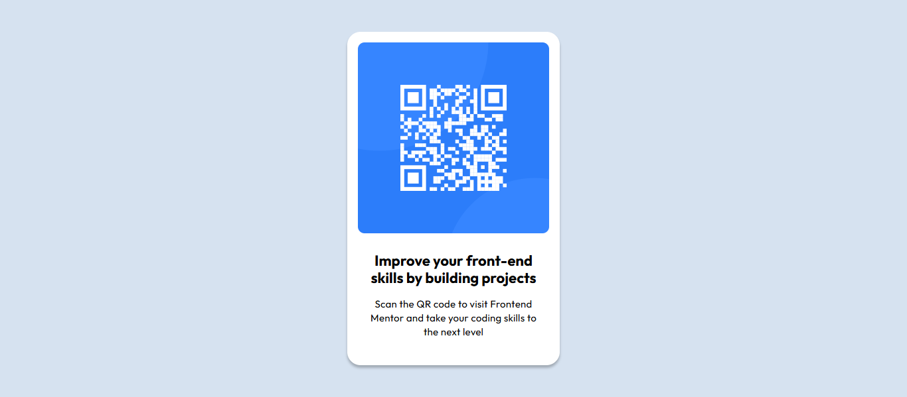

# Frontend Mentor - QR code component solution

This is a solution to the [QR code component challenge on Frontend Mentor](https://www.frontendmentor.io/challenges/qr-code-component-iux_sIO_H). Frontend Mentor challenges help you improve your coding skills by building realistic projects.

## Table of contents

- [Overview](#overview)
  - [Screenshot](#screenshot)
  - [Links](#links)
- [My process](#my-process)
  - [Built with](#built-with)
  - [What I learned](#what-i-learned)
  - [Continued development](#continued-development)
  - [Useful resources](#useful-resources)
- [Author](#author)
- [Acknowledgments](#acknowledgments)

**Note: Delete this note and update the table of contents based on what sections you keep.**

## Overview

### Screenshot



### Links

- Solution URL: [Add solution URL here](https://your-solution-url.com)
- Live Site URL: [Add live site URL here](https://your-live-site-url.com)

## My process

### Built with

- Semantic HTML5 markup
- CSS custom properties
- Flexbox

### What I learned

- How to work with images within a container

```css
img {
  width: 100%;
  height: auto;
}
```

- How to vertically & horizontally center a div, also using utiltiy classes

```css
.centered {
  display: flex;
  align-items: center;
  justify-content: center;
  flex-direction: column;
}
```

- Using CSS Custom Properties

```css
:root {
  --ff-outfit: "Outfit", serif;
  --fs-heading: 1.375rem; /* 22px */
  --fs-body: 0.9375rem; /* 15px */
  --fs-anchor: 1rem; /* 16px */

  --clr-white: hsl(0, 0%, 100%);
  --clr-slate-300: hsl(212, 45%, 89%);
  --clr-slate-500: hsl(216, 15%, 48%);
  --clr-slate-900: hsl(218, 44%, 22%);

  --padding-m: 1rem; /* 16px */

  --margin-m: 1rem; /* 16px */
  --margin-l: 1.5rem; /* 24px */
  --margin-xl: 2.5rem; /* 40px */

  --br-outer: 1.25rem; /* 20px */
  --br-inner: 0.625rem; /* 10px */
}
```

### Continued development

- Responsive Design
- More indepth flexbox
- CSS Grid

## Author

- Website - [Add your name here](https://www.your-site.com)
- Frontend Mentor - [@yourusername](https://www.frontendmentor.io/profile/yourusername)
